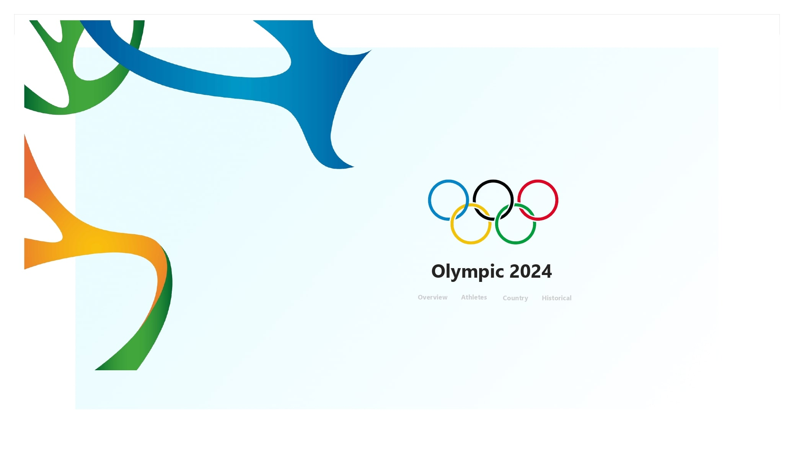
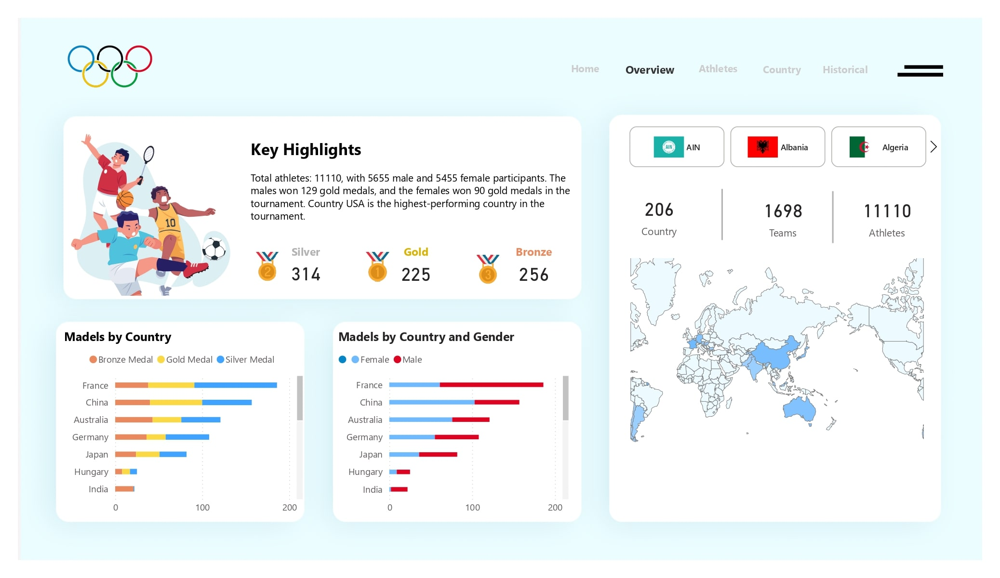
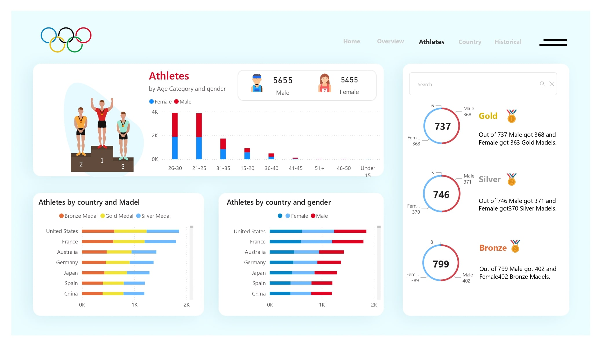
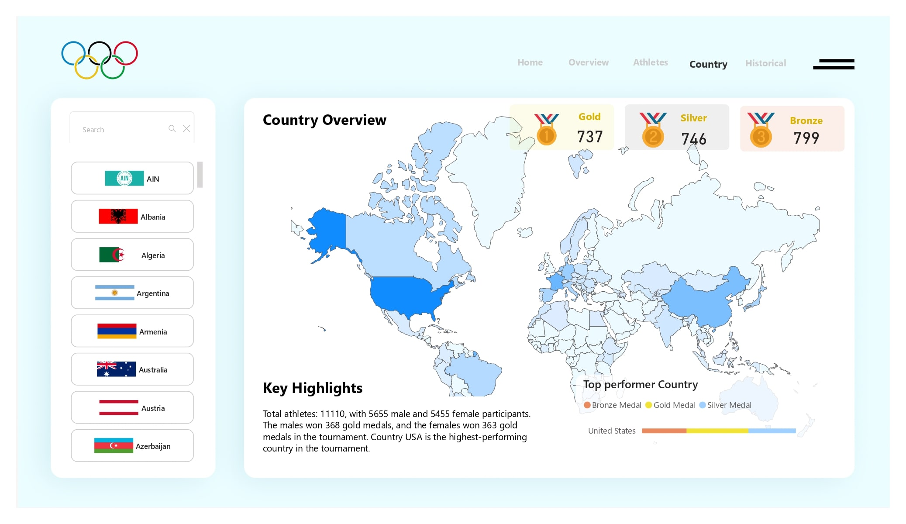
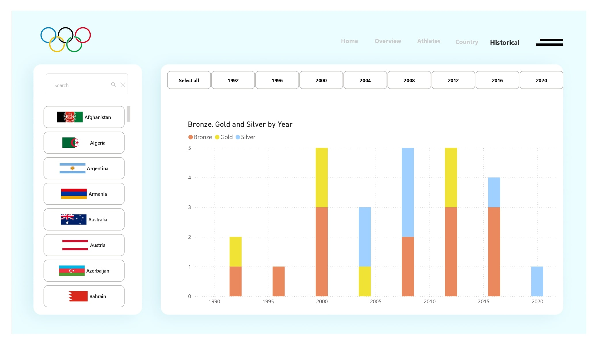

# Olympics 2024 Data Dashboard

**[GitHub Repo](https://github.com/U77w41/Power-BI-Dashboards/tree/main/Olympic-2024-Dashboard)**

## Project Overview

This Power BI dashboard provides an interactive visualization of the Olympics 2024 data, focusing on key statistics related to medals, athletes, countries, and historical performances. The dashboard is divided into five pages, each tailored to present specific insights through dynamic filtering and visually engaging elements.

---

## Dataset Information

- **Source**: [Kaggle - Paris 2024 Olympic Summer Games Dataset](https://www.kaggle.com/datasets/piterfm/paris-2024-olympic-summer-games)  
- **Description**:  
  The Paris 2024 Olympic Summer Games dataset offers comprehensive data about the Summer Olympics held in 2024. It includes:
  - Participating countries
  - Athletes
  - Sports disciplines
  - Medal standings
  - Key event details  
  The dataset provides a solid foundation for analyzing the event's performance and trends.  

- **Additional Resources**:
  - [Official Site - Paris 2024 Olympics](https://olympics.com/en/paris-2024)
  - [Wikipedia - 2024 Summer Olympics](https://en.wikipedia.org/wiki/2024_Summer_Olympics)

---

## Pages Overview

### 1. **Home**
- **Purpose**: The landing page of the dashboard.

- **Features**:
  - Navigation buttons or links to seamlessly guide users to other pages.

---

### 2. **Overview**
- **Purpose**: Provides a comprehensive summary of medal statistics for the Olympics 2024.

- **Features**:  
  - **Medals by Country and Gender**: Visualized using bar/column charts or other relevant visualizations to showcase the distribution of medals.  
  - **Key Highlights**:  
    - Created using a **Measure Query** to dynamically calculate and display critical statistics (e.g., total medals won, top-performing countries).  
  - **Custom Map Visualization**:  
    - Displays medallist density by country, offering a geographic perspective.  
    - Enhances understanding of country-wise performance.  
  - **Game-wise Filtering**:  
    - Users can filter all visualizations on this page by selecting specific games.  
    - Improves interactivity and customization for detailed analysis.

---

### 3. **Athletes**
- **Purpose**: Focuses on individual athletes and their achievements.

- **Features**:
  - **Filters**:  
    - By Country, Game, Gender, and Medals Won.  
    - Enables users to drill down into specific athlete data based on selected criteria.  
  - **Visualizations**:  
    - Highlight athletes' contributions to their countries' performances.  
    - Possible use of tables, cards, or slicers for detailed and filtered views.

---

### 4. **Country**
- **Purpose**: Analyzes the performance of countries in the Olympics 2024.

- **Features**:  
  - **Summary Statistics**:  
    - Total medals won by countries.  
    - Comparative analysis of countries' performances.  
  - **Game-wise Filtering**:  
    - Allows users to explore country-level statistics for selected games.  
  - **Visualizations**:  
    - Incorporates bar charts, tables, or other visual elements for an impactful representation.

---

### 5. **Historical**
- **Purpose**: Explores historical Olympic games data and trends.

- **Features**:
  - **Summary Statistics**:  
    - Historical medals won by countries.  
  - **Filters**:  
    - By Country and Games, enabling users to focus on specific historical data.  
  - **Visualizations**:  
    - Trends over multiple Olympic years to understand performance changes.  
    - Graphs and timelines to depict historical achievements effectively.

---

## Key Highlights
- **Interactivity**: Filters across pages allow for granular analysis and customization.  
- **Custom Mapping**: A unique visual element that enhances geographic insights.  
- **Dynamic Measures**: Queries calculate and display real-time statistics.  
- **Comprehensive Visuals**: Diverse charts, maps, and tables present data intuitively.

---

## Applications
- Suitable for analysts, sports enthusiasts, and stakeholders interested in Olympics 2024 performance data.  
- Helps in understanding medal trends, athlete achievements, and country-wise statistics.  
- Provides a historical perspective to assess long-term performance.

---