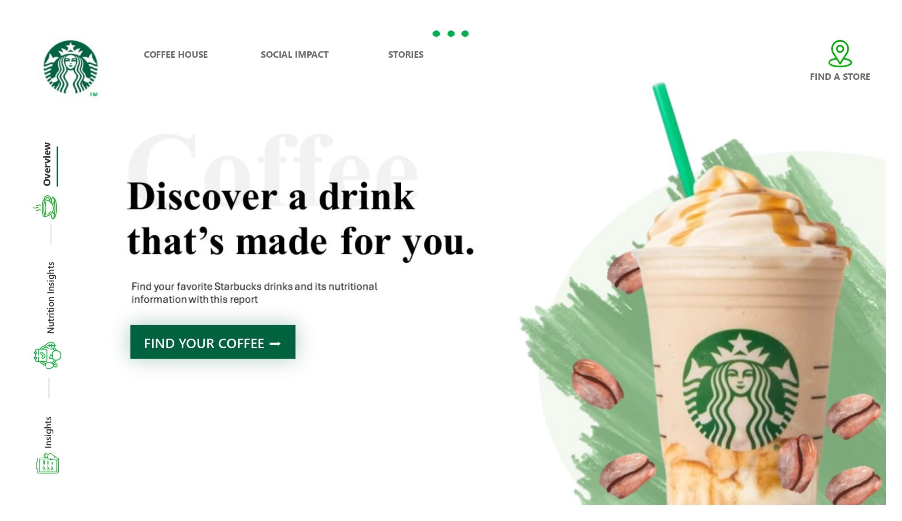
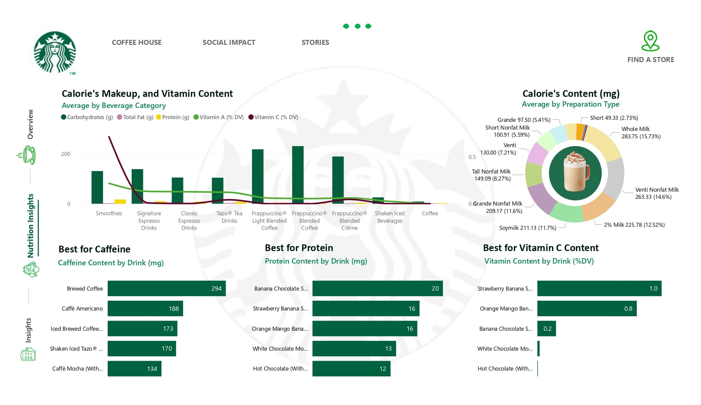
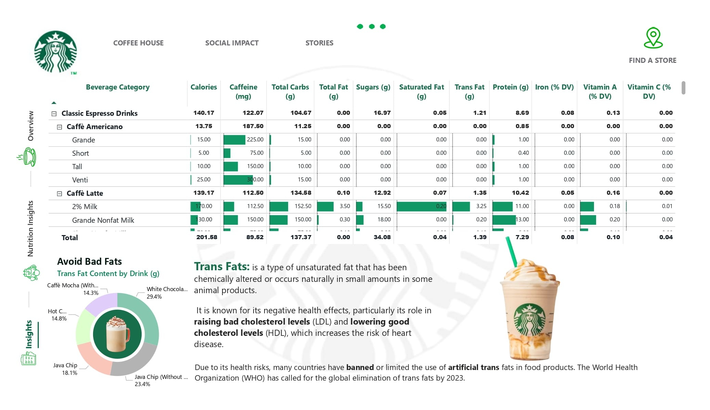
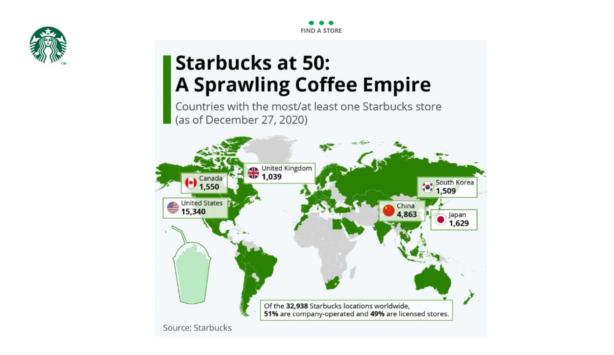

# Starbucks Drinks Nutritional Dashboard
**[GitHub Repo](https://github.com/U77w41/Power-BI-Dashboards/tree/main/Starbucks-Drinks-Dashboard)

## Project Overview
A comprehensive Power BI dashboard analyzing Starbucks drink products, focusing on nutritional content, health insights, and store location information. The dashboard provides a holistic view of Starbucks' product offerings through four interconnected pages.

**Key Visualizations**:
- Total number of drink products
- Drink categories distribution
- Average nutritional values across product lines
- Top-performing drinks by various nutritional criteria

## Dashboard Architecture

### 1. Overview Page
**Purpose**: Provide a introduction page of Starbucks drink portfolio and key nutritional metrics.

### 2. Nutritional Insights Page
**Purpose**: Detailed nutritional breakdown of Starbucks products

**Nutritional Analysis**:
- Vitamin content visualization
- Protein levels across different drinks
- Fat content analysis
- Vitamin C concentration
- Interactive comparisons between products

**Key Features**:
- Comparative charts
- Drill-down capabilities
- Filtering options by drink type and size

### 3. Advanced Nutritional Insights Page
**Purpose**: In-depth exploration of nutritional challenges and health-critical metrics

**Specialized Visualizations**:
- Trans Fat Content Analysis
  - Identification of high trans fat products
  - Comparative trans fat levels across drink categories
- Sugar Content Mapping
- Mineral composition
- Calorie density visualization

**Health Focus**:
- Warnings for high-risk nutritional profiles
- Color-coded indicators for nutritional extremes

### 4. Store Locator Page
**Purpose**: Store location mapping

*World map with Starbucks store locations*

## Technical Implementation

**Platform**: Microsoft Power BI

**Data Processing**:
- Advanced data cleaning
- Nutritional value normalization

## Interactive Dashboard Capabilities
- Cross-page filtering
- Dynamic data exploration
- Responsive design

## Target Audience
- Health-conscious consumers
- Nutritionists and dieticians
- Starbucks management
- Product development teams
- Marketing strategists

## Business Insights
1. **Nutritional Transparency**
   - Comprehensive product information
   - Clear health impact visualization

2. **Product Strategy**
   - Identify high-performing nutritional profiles
   - Guide product development
   - Support marketing positioning

3. **Consumer Education**
   - Empower informed beverage choices

## Future Enhancement Roadmap
- Integration with real-time nutritional tracking
- Personalized nutritional recommendation engine
- Expanded global store data

## Usage Guidelines
1. **Navigation**
   - Use page tabs for different perspectives
   - Utilize filters for focused analysis
   - Hover for detailed tooltips

2. **Interpretation Tips**
   - Compare drinks within categories
   - Use store locator for nearby options

## Data Disclaimer
Important Notice:
### 🚨 Data Integrity Warning 🚨

- This dashboard is created using DUMMY/SIMULATED DATA.
- The nutritional information, store locations, and all visualizations are NOT REAL.
- Data is purely for demonstration and educational purposes.
- DO NOT use this data for actual nutritional planning or decision-making.
- All data points are synthetic and do not represent actual Starbucks products or nutritional facts.
