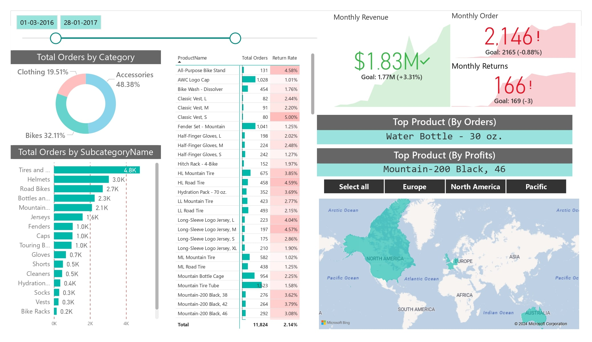
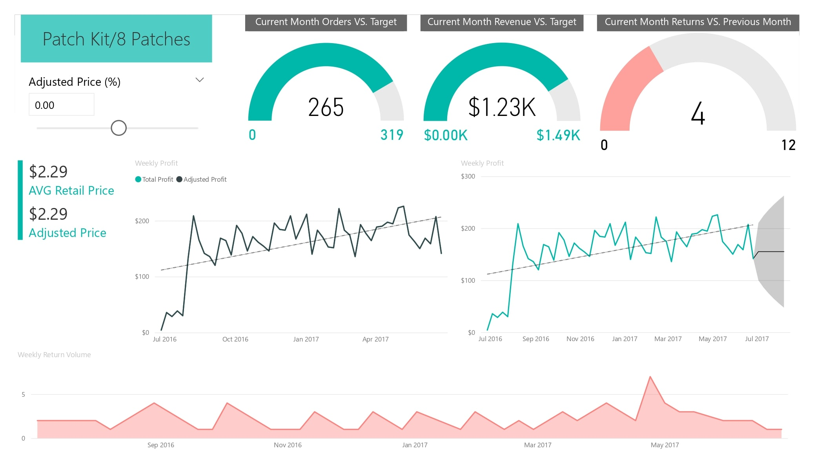
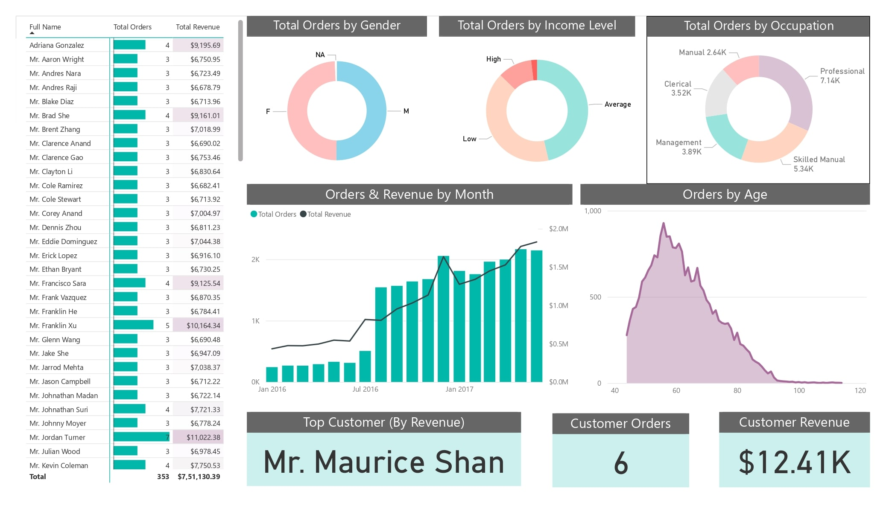

**[GitHub Repo](https://github.com/U77w41/Power-BI-Dashboards/tree/main/Visualizing-Microsoft-AdventureWorks-Data)**

# AdventureWorks Sales Analytics Dashboard

## Project Overview
This Power BI dashboard provides comprehensive sales analytics for AdventureWorks, offering insights into revenue, orders, returns, and customer demographics. The dashboard consists of three interconnected pages, each focusing on specific aspects of the business.

## Dashboard Structure

### 1. Sales Overview Page
**Purpose**: Provides a high-level summary of key business metrics with dynamic filtering capabilities.

**Key Features**:
- Revenue analysis across different dimensions
- Order volume tracking
- Returns monitoring
- Product performance metrics

**Filters**:
- Order Category
- Order Subcategory
- Geographical Location
- Date Range

### 2. Performance Metrics Page
**Purpose**: Compares current performance against targets and tracks temporal trends.

**Key Visualizations**:
- Current month vs target comparison for:
  - Order volume
  - Revenue
  - Returns
- Weekly profit and revenue trends
- Performance gauges and KPI cards

### 3. Customer Analytics Page
**Purpose**: Deep dive into customer demographics and behavior patterns.

**Customer Segmentation by**:
- Gender distribution
- Income levels
- Occupational categories
- Age groups
- Order history

## Data Source
- **[Microsoft AdventureWorks sample database](https://learn.microsoft.com/en-us/sql/samples/adventureworks-install-configure?view=sql-server-ver16&tabs=ssms)**

## Technical Implementation
**Platform**: Microsoft Power BI

## Interactive Features
- Cross-filtering capabilities across all pages
- Drill-down functionality from category to subcategory levels
- Dynamic date range selection
- Tooltip enriched visualizations

## Intended Users
- Sales Management
- Executive Leadership
- Regional Managers
- Product Teams
- Customer Service Representatives

## Business Benefits
1. **Informed Decision Making**
   - Real-time access to critical business metrics
   - Comparison of actual performance against targets

2. **Customer Insights**
   - Better understanding of customer segments
   - Identification of high-value customer groups
   - Analysis of purchasing patterns

3. **Operational Efficiency**
   - Quick identification of underperforming areas
   - Monitoring of returns and potential quality issues
   - Geographical performance analysis

## Future Enhancements
- Integration with predictive analytics
- Addition of inventory management metrics
- Enhanced customer segmentation analysis
- Mobile-optimized view

## Usage Guidelines
1. **Navigating the Dashboard**
   - Use the tabs at the bottom to switch between pages
   - Apply filters consistently across all pages
   - Utilize drill-through functionality for detailed analysis

2. **Best Practices**
   - Start with the Overview page for high-level insights
   - Use date filters to focus on specific periods
   - Export specific views for reporting purposes